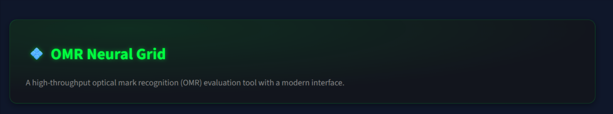
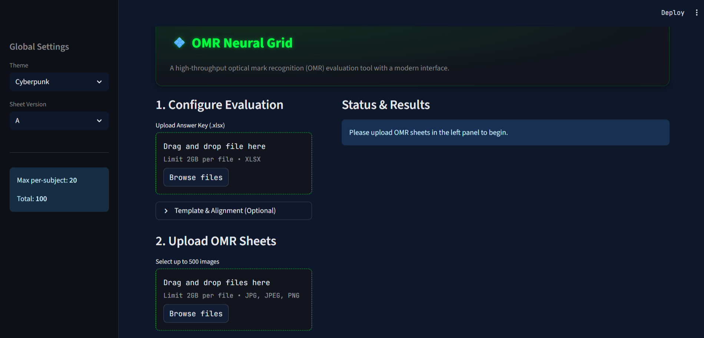
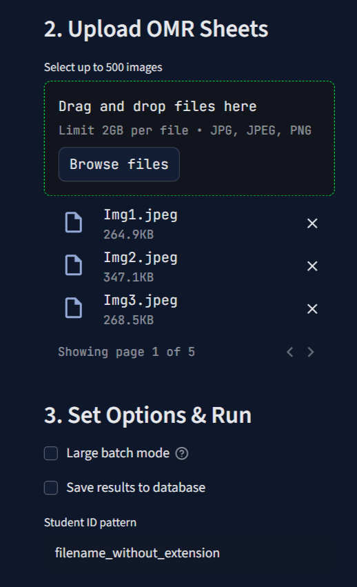
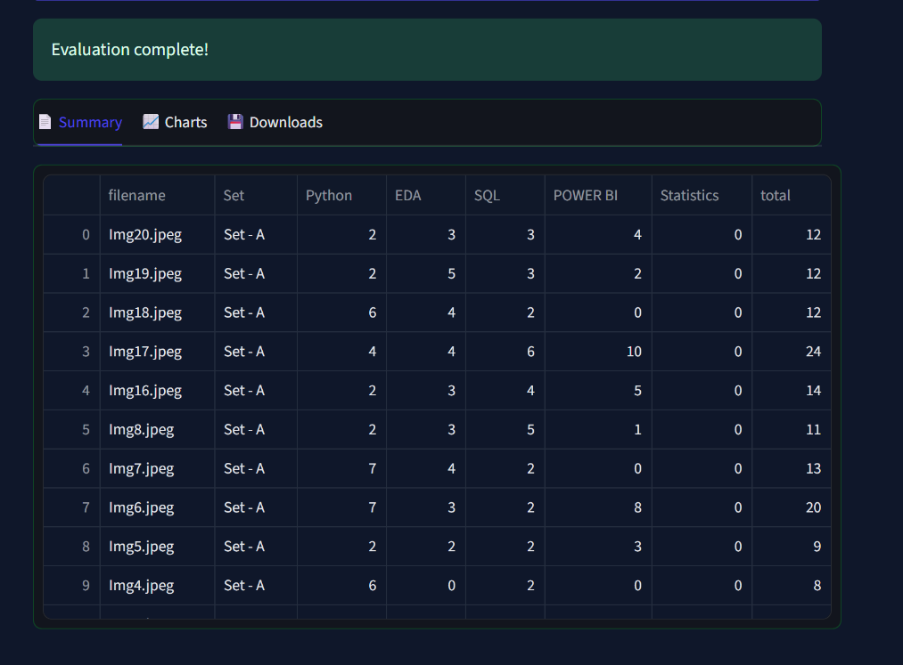

# 💠 OMR Neural Grid: Next-Gen Optical Mark Recognition System



---

## ✨ Overview

**OMR Neural Grid** is a powerful, modern, and highly customizable Optical Mark Recognition (OMR) evaluation platform. Designed for educators, institutions, and developers, it enables rapid, accurate, and beautiful assessment of OMR answer sheets at scale. With a focus on usability, flexibility, and analytics, OMR Neural Grid brings together a stunning UI, robust batch processing, and deep insights—all in one open-source package.

---

## 🌟 Key Features

- **Modern Streamlit UI**: Responsive, themeable (Cyberpunk, Synthwave, Light), and intuitive.
- **Batch Processing**: Evaluate up to 500 OMR sheets in a single run.
- **Flexible Answer Keys**: Upload Excel answer keys with support for multiple sets/sheets.
- **Template & Alignment**: Fine-tune recognition with custom JSON templates and alignment controls.
- **Detailed Analytics**: Per-student, per-subject, and total score breakdowns, with interactive charts.
- **Downloadable Results**: Export results as Excel (multi-sheet) or CSV.
- **Database Integration**: (Optional) Save results directly to your database.
- **Extensible Backend**: Modular API and service layers for advanced integrations.
- **Open Source**: MIT licensed, community-driven, and easy to extend.

---

## �️ Screenshots

| Home Page | Batch Upload | Results & Analytics |
|-----------|-------------|---------------------|
|  |  |  |

---

## 📦 Installation Guide

### 1. Clone the Repository
```bash
git clone https://github.com/exceptional007/OMR-Evaluation-System.git
cd omr-evaluation-system-main
```

### 2. Set Up Python Environment
- **Python 3.8+ recommended**
- Create and activate a virtual environment:
	- **Windows:**
		```bash
		python -m venv venv
		venv\Scripts\activate
		```
	- **Linux/Mac:**
		```bash
		python3 -m venv venv
		source venv/bin/activate
		```

### 3. Install Dependencies
```bash
pip install -r requirements.txt
```

### 4. (Optional) Install Additional Tools
- For advanced features (e.g., database, OpenCV), check `requirements.txt` and `requirements.dev.txt`.

---

## 🚦 Quick Start

```bash
streamlit run streamlit_app.py
```

- The app will open in your browser at [http://localhost:8501](http://localhost:8501)
- For API/backend usage, see the `api/` and `app/` folders.

---

## 📝 Step-by-Step Usage Guide

### 1. Configure Global Settings
- **Theme**: Select your preferred UI theme (Cyberpunk, Synthwave, Light) from the sidebar.
- **Sheet Version**: Choose the OMR sheet version (A/B/C/D) matching your answer sheets.
- **Score Info**: View per-subject and total maximum scores.

### 2. Upload Answer Key
- Click **Upload Answer Key (.xlsx)** and select your answer key Excel file.
- If your file has multiple sheets (sets), select the correct one from the dropdown.
- The app will parse and load the answer key, showing a success message.

### 3. (Optional) Template & Alignment
- Expand the **Template & Alignment** section.
- Upload a custom template JSON for non-standard OMR layouts.
- Adjust alignment parameters:
	- **Fill Threshold**: Sensitivity for filled bubbles.
	- **Min Margin**: Minimum difference between top two choices.
	- **Scale X/Y**: Fine-tune horizontal/vertical scaling.
	- **Offset X/Y**: Shift the grid for perfect alignment.
	- **Show Debug Overlay**: Visualize detection overlays on images.

### 4. Upload OMR Sheets
- Click **Select up to 500 images** and upload your scanned OMR answer sheets (`.jpg`, `.jpeg`, `.png`).
- The app will queue and display the number of images uploaded.

### 5. Set Options & Run Evaluation
- **Large Batch Mode**: Enable for 200+ images to speed up processing (skips per-image sheets in export).
- **Save to Database**: Optionally store results in your database (configure in `app/core/config.py`).
- **Student ID Pattern**: Set how student IDs are extracted (e.g., from filename).
- Click **Evaluate** to start processing.

### 6. Monitor Progress
- A progress bar and live status metrics will show evaluation progress.
- Errors (if any) are reported per file.

### 7. View & Download Results
- **Summary Tab**: View a table of all results (filename, set, per-subject, total scores).
- **Charts Tab**: Visualize total score distribution and per-subject averages.
- **Downloads Tab**: Export results as Excel (with per-image sheets) or CSV.

---

## 📂 Project Structure

```
├── streamlit_app.py         # Main Streamlit UI
├── requirements.txt         # Python dependencies
├── api/                    # API backend (optional)
│   └── ...
├── app/                    # App core logic
│   ├── core/
│   ├── db/
│   ├── routers/
│   └── services/
├── templates/              # Example OMR templates
├── tests/                  # Test scripts
├── _external/              # External OMR libraries
│   └── OMRChecker-master/
└── README.md               # This file
```

---

## 🛠️ Advanced Configuration

### Custom OMR Templates
- Place your custom JSON templates in the `templates/` folder.
- Reference them in the UI for custom sheet layouts.

### API & Backend
- Extend or integrate with the backend via the `api/` and `app/` folders.
- Add new routers, services, or database models as needed.

### Database Integration
- Configure your database connection in `app/core/config.py`.
- Supported: SQLite, PostgreSQL, MySQL, etc. (via SQLAlchemy/FastAPI)

### Environment Variables
- Set `API_BASE_URL` and other environment variables as needed for deployment.

---

## 🧪 Testing

- Run unit tests with:
```bash
pytest
```
- Add your own tests in the `tests/` directory.

---

## 🤝 Contributing

We welcome contributions of all kinds! To get started:
1. Fork the repository
2. Create a new branch (`git checkout -b feature/your-feature`)
3. Commit your changes
4. Push to your fork and open a Pull Request

See `CONTRIBUTING.md` for more details.

---

## 📄 License

This project is licensed under the MIT License. See `LICENSE` for details.

---

## 🙏 Acknowledgements

- [Streamlit](https://streamlit.io/)
- [Pandas](https://pandas.pydata.org/)
- [OpenCV](https://opencv.org/)
- [FastAPI](https://fastapi.tiangolo.com/)
- [SQLAlchemy](https://www.sqlalchemy.org/)
- All contributors and the open-source community!

---

## 📬 Contact & Support

- **Issues**: Please use the [GitHub Issues](https://github.com/anay555/omr-evaluation-system-main/issues) page for bug reports and feature requests.
- **Email**: [akshhatsri7843@gmail.com](mailto:akshhatsri7843@gmail.com)
- **Discussions**: Join our community forum (coming soon!)

---

> _Empowering educators and institutions with fast, accurate, and beautiful OMR evaluation. Built with ❤️ for the future of assessment._
